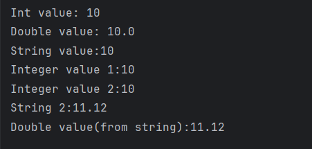

# MAD Practicals (Mobile Application Development)

This repository contains **11 Kotlin programs** demonstrating the basics of Mobile Application Development (MAD).  
Each practical includes source code and its corresponding output screenshot.

---

## 📘 Practicals List

### ✅ Practical 1: Basic Data Types in Kotlin
- Create and display variables of different data types, including Integer, Double, Float, Long, Short, Byte, Char, Boolean, and String.
- Demonstrates usage of primitive data types.
- 

### ✅ Practical 2: Type Conversion in Kotlin
- Perform type conversions such as Integer to Double, String to Integer, and String to Double.
- Demonstrates type casting and conversions.
- 

### ✅ Practical 3: Student Data Program
- Input and display data of students, including their name, enrolment no, branch,etc.
- Prints student details using variables & string interpolation.
- 

### ✅ Practical 4: Odd/Even Number Check
- Determine whether a number is odd or even using control flow within println() method.
- Checks whether input number is odd or even.
- 

### ✅ Practical 5: Month Finder
- Use a when expression to display the month name based on user input.
- Prints month name from user’s choice (1–12).
- 

### ✅ Practical 6: Arithmetic Operations
- Create a user-defined function to perform arithmetic operations (addition, subtraction, multiplication, division) on two numbers
- Performs addition, subtraction, multiplication, division.
- 

### ✅ Practical 7: Factorial Program
- Calculate the factorial of a number using recursion.
- Factorial using normal recursion & tail recursion.
- 

### ✅ Practical 8: Arrays and Maximum Element
- Explore array operations such as Arrays.deepToString(), contentDeepToString(), IntArray.joinToString(), and use them to print arrays. Utilize various loop types like range, downTo, until, etc., to manipulate arrays. Sort an array of integers both without using built-in functions and with built-in functions.
- Reads array, prints elements, finds the largest number.
- 

### ✅ Practical 9: Classes and Objects
- Write a program to find the maximum number from an ArrayList of integers.
- Demonstrates OOP by creating a class and its objects.
- 

### ✅ Practical 10: Functions
- Define different classes and constructors. Create a "Car" class with properties like type, model, price, owner, and miles driven. Implement functions to get car information, original car price, current car price, and display car information
- Demonstrates different types of functions in Kotlin.
- 

### ✅ Practical 11: Inheritance
- Explain operator overloading and implement matrix addition, subtraction, and multiplication using a "Matrix" class. Overload the toString() function in the "Matrix" class for customized output.
- Demonstrates inheritance in Kotlin with parent and child classes.
- 

## 📷 Screenshots
All screenshots are available inside the `screenshots/` folder.
